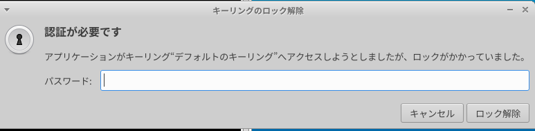
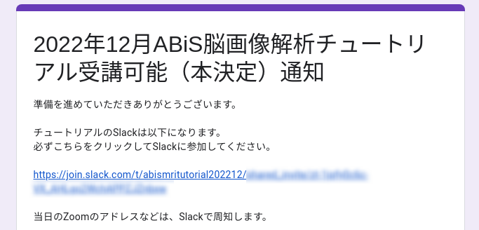

# ABiS脳画像解析チュートリアル23.01

ここは、2023年01月28-29日に開催予定である **『先端バイオイメージング支援プラットフォーム・ABiSチュートリアル』** の受講者を対象とした情報提供サイトです。新しい情報があれば、随時このサイトへ追加していきますので、定期的にアクセスするようにして下さい

## 目次

- [新着情報](#anchor0)
- [チュートリアルのスケジュール](#anchor1)
- [受講のための準備](#anchor2)
    - [パソコンのスペック](#anchor2_0)
    - 解析環境のセットアップ
        - [チュートリアル用Lin4Neuroのセットアップ](#anchor2_1)
        - [macOSネイティブ環境でのソフトウェアセットアップ](#anchor2_2)
    - [チュートリアル用テキスト・データ配布リポジトリのセットアップ](#anchor2_3)
    - [データの入手](#anchor2_4)
    - [受講のためのスクリプト実行](#anchor2_5)
- [問い合わせ](#anchor3)


<a id="anchor0"></a>

## 新着情報

- 2022.12.16 チュートリアル用ウェブサイトを立ち上げました


<a id="anchor1"></a>

## チュートリアルのスケジュール (予定)

- 現在調整中です
- 両日ともに9:00-18:00の予定です

<a id="anchor2"></a>

## 受講のための準備

- チュートリアルはご自身の環境で受講していただきます。そのために事前準備が必須となっております。講師と同じ環境で解析をするため、仮想化ソフト VirtualBox を使用し、そのうえで、脳画像解析に特化したLinux, Lin4Neuro を使いながらチュートリアルは進めていきます。(なお、Apple M1/M2 CPUをお使いの方は VirtualBox が正式に対応していないので、個別にソフトウェアをセットアップしていただくことになります。) 事前準備を済ませたうえで、受講のためのスクリプトを実行し、それが正しい結果を出した方にZoomおよびSlackのアドレスをお示しします。早めにご準備のほどよろしくお願いします。なお、今回お配りするLin4Neuroは2022年12月および2023年1月用に最適化されています。2022年1月以前のLin4Neuroにはソフトが入っていないものがいくつもありますので、改めてセットアップをお願いします

- 流れは以下になります
    - 解析環境のセットアップ
    - チュートリアルのテキスト・データ配布リポジトリのセットアップ
    - チュートリアルのデータ入手
    - 受講のためのスクリプト実行
    - 本登録

<a id="anchor2_0"></a>

### パソコンのスペック

- チュートリアルでは、受講者にご自身でPCを準備して頂き、実際に操作しながらコマンドラインについて学んでいきます。PCのスペックについては、以下の **推奨条件** を参考にして下さい

    - OS: Windows 10/11 64bit版 または macOS 11.x (Big Sur) - 12.x (Monterey)
        - **注意**: macOS 10.15 (Catalina) は Lin4neuroはうまく動作しないため、macOS native でいれる必要があります
    - CPU: Intel Core i7/i9、Intel Core i5（クロック周波数2.0GHz以上）、または AMD Ryzen 5以上の性能を有するもの 
        - **注意: 現在、Apple M1/M2はVirtualBoxでLin4Neuroを動作できないため、チュートリアルで使用するソフトは個別にインストールしていただく必要があります。完全なサポートができないことをご承知おきください**
    - メモリ：8GB以上 (可能ならば16GB以上を推奨します)
    - ハードディスク：250GB以上の空き容量 (外付けハードディスクも可)
    - 2ボタン以上のUSBマウス (必須ではありませんが、持っていると便利です)
    - 2画面のディスプレイ (自身の作業用とZoomの画面をうつすために2画面を推奨します。2画面が準備できない方は、Zoomの画面をうつすためだけのPCやタブレットを準備してください)

### 解析環境のセットアップ

<a id="anchor2_1"></a>

#### チュートリアル用Lin4Neuroのセットアップ (所要時間約2-3時間) 

- チュートリアル用Lin4Neuroのセットアップは[こちらのインストラクション](./setup_l4n_2022.md){:target="_blank"} に従って準備を進めてください。2022年12月のチュートリアルの参加者はここは終わっていますので、「チュートリアル用テキスト・データ配布リポジトリのセットアップ」に進んでください

<a id="anchor2_2"></a>
#### macOS ネイティブ環境でのソフトウェアセットアップ (所要時間約1時間)

- Apple M1/M2 の方は、各自でソフトウェアをインストールしていただく必要があります。また、Intel Mac をお使いの方で、ネイティブ環境で構築したい場合もあるかと思います。その場合は[こちらのインストラクション](./setup_macnative_2022.md){:target="_blank"} に従って準備を進めてください。2022年12月のチュートリアルの参加者はここは終わっていますので、次の「チュートリアル用テキスト・データ配布リポジトリのセットアップ」に進んでください

<a id="anchor2_3"></a>
### チュートリアル用テキスト・データ配布リポジトリのセットアップ (所要時間約3分) 

- チュートリアルで使用するテキストは、GitLabというデータ共有サービスを通して配布します。ここで配布されるものは、チュートリアルの1週間前まで更新される可能性がありますので、こまめに（特に参加直前に）アップデートするようにして下さい

- macOS ネイティブ環境で参加される方は、以下のコマンドにより、ホームディレクトリの下に abis フォルダを作成します。このようにすることで、iCloud の管理外になりますので、iCloudが問題になることを防ぐことができます

   ```
   mkdir ~/abis
   ```

1. 初めてセットアップする時: ターミナルから以下を実行してください。なお、ターミナルは、Lin4Neuro では左下のスタートアイコンの隣にあるアイコンから起動できます。macOSの方はユーティリティからターミナルを実行してくだい

    ```
    cd ~/abis
    受講者仮決定メールに記されているコマンドをここにタイプします
    (セキュリティの都合でここには記しません)
    ```

2. 更新する時: ターミナルから以下を実行してください

    ```
    cd ~/abis/abis-202301
    git pull
    ```

- こうすると、`~/abis/abis-202301` の下に `rsfmri`, `tfmri`, `textbook` のフォルダが生成されます

<a id="anchor2_4"></a>
### データの入手 (所要時間約1時間) (現在準備中)

- チュートリアルに使うデータは大きいため、GitLabではなく、別にダウンロードしていただきます

- 上記のテキストの入手を行った後、ターミナルから以下をタイプしてください

    ```
    cd ~/abis/abis-202301
    ./get_data.sh
    ```

- データが数GB程度ありますので、約1時間程度見込んでください。環境によってはさらに時間がかかってしまうことがあるため、電源を必ずつなぎ、パソコンがスリープしないようにしてください

- こうすると、`abis-202301` の `rsfmri`, `tfmri` の中にそれぞれデータが準備されます

<a id="anchor2_5"></a>
### 受講のためのスクリプト実行 (所要時間約45分) 

- 環境がすべて整っているかを確認するために、確認スクリプトを実行していただきます

- ターミナルから以下をタイプしてください

    ```
    cd ~/abis/abis-202301
    ./abis_test.sh
    ```

- そうすると以下が表示されます

    ```
    CONN, SPM の動作確認を行います
    はじめて実行する場合は、20分程度かかります
    最後に出力される数値を報告してください
    yesまたはnoを入力してください
    ```

- `yes` をタイプすると、CONN のコマンド 及び SPM のコマンド が走りはじめます

- コマンドの実行が完了すると、ターミナルに以下が表示されます。

    ```
    ------------------------------------------------
    以下の数値を報告してください
    XXX
    ------------------------------------------------
    ```

- さらに、続いて以下が表示されます

    ```
  　数値報告用のフォームを開いてよろしいですか? 
  　yesまたはnoを入力してください
    ```

- `yes` をタイプすると、webブラウザー が立ち上がり、数値入力用の Googleフォーム が開きます。なお、下図のように「キーリングのロック解除」画面が出たら、パスワードに lin4neuro と入力してください

    

- Googleフォーム に必要項目をご入力ください
    
- 入力した数値が正しい場合には、その次の画面に受講者専用のSlackのリンクが表示されます。こちらからSlackに登録してください

    

- もし、解析が途中で失敗した場合は、以下が表示されます

    ```
    なんらかの問題が起こっているようです
    問い合わせフォームからお問い合わせください
    ```

- 問い合わせフォームが立ち上がりますので、そこからトラブルシューティングを依頼してください

<a id="anchor3"></a>
## 問い合わせ

- 準備がうまくいかない時のために、問い合わせフォームを準備しています。こちらからご質問ください。数日以内に担当者から返信させていただきます

- [問い合わせフォーム](https://forms.gle/CniDGw5J1BSxEqjn9){:target="_blank"} 


