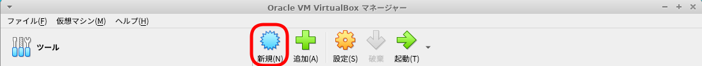
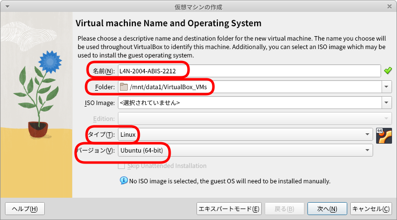
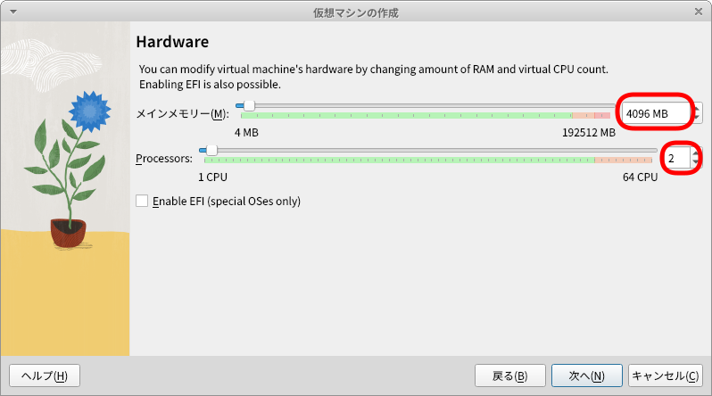
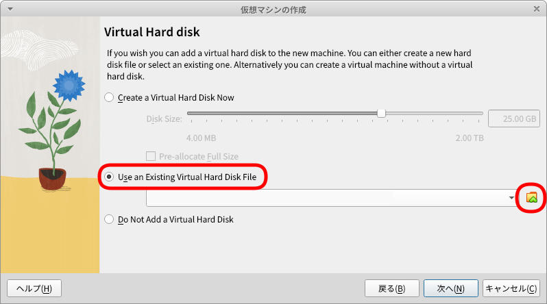
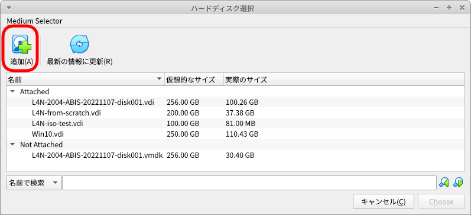
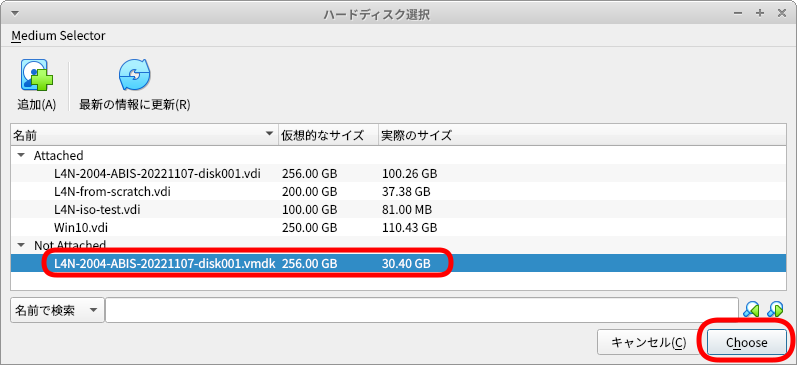
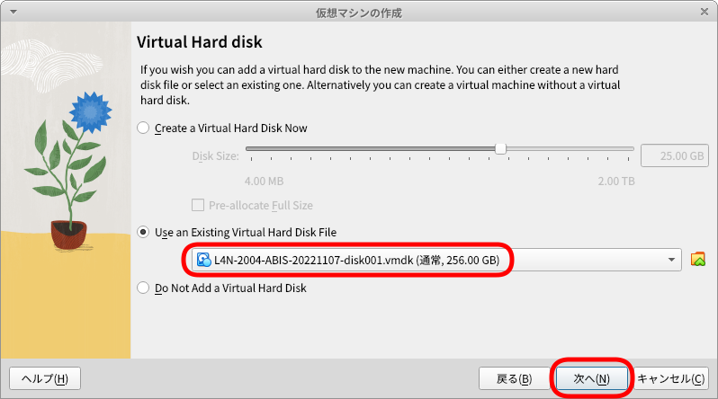
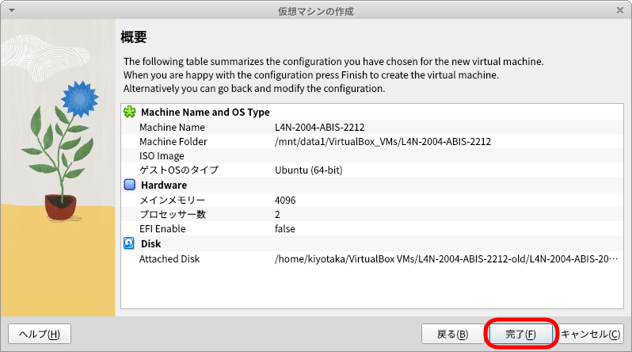
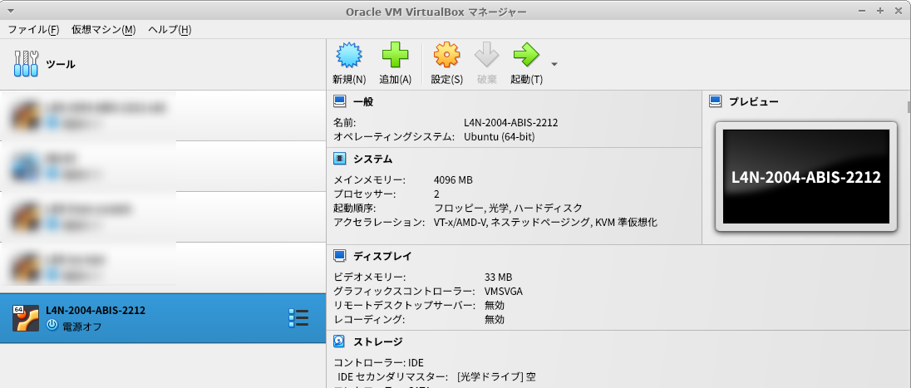

# Lin4Neuroがインポートできない場合

0x80004005 などのエラーでLin4Neuroが起動できない、もしくはインポートできない場合は、以下を試してください

## 準備

- VirtualBox 7.0.2 以降はインストールされている前提でいきます

- エラーとなったLin4Neuroは右クリック -> 除去 -> すべてのファイルを削除 から削除してください

- ovaファイルを保存するフォルダを作成してください。ここでは、l4n-ova というフォルダを作成すると仮定します

    ```
    mkdir l4n-ova
    ```

- 以下のリンクから、L4N-2004-ABIS-20221107-disk001.vmdk をダウンロードし、このl4n-ovaフォルダの中に保存します

    https://www.dropbox.com/t/uYIYllcbIyhIMXxL


## VirtualBoxへの登録
- VirtualBoxマネージャーで、「新規」をクリックします

    

- 以下を設定します
    - 名前: L4N-2004-ABIS-2212 としてください
    - Folder: 自分がインストールしたいフォルダ (250GB以上空き容量があるところ) を指定してください
    - タイプ: Linux を選んでください
    - バージョン: Ubuntu (64-bit) を選択してください
    - ここまで選んだら「次へ」をクリックします

    

- メモリは 4096MB、CPUは2を設定して「次へ」をクリックしてください(任意ですが、まずはこれで)

    

- Virtual Hard disk の画面では、"Use an Existing Virtual Hard Disk File" を選び、その右側のフォルダアイコンをクリックしてください

    

- ハードディスク選択の画面で、「追加」をクリックし、先程展開した L4N-2004-ABIS-20221107-disk001.vmdk を選びます

    

- そうすると、Not attached のところにL4N-2004-... があらわれるので、それを選択して"Choose" をクリックしてください

    

- 今選択したハードディスクが表示されていることを確認してから、次へをクリックします

    

- これで「完了」を押すと完了です

    

- 選択して起動するかどうかを確認してください

    


