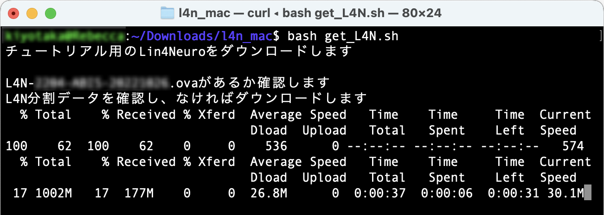
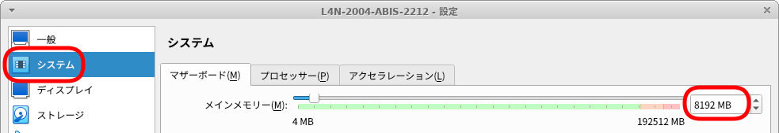
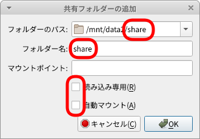
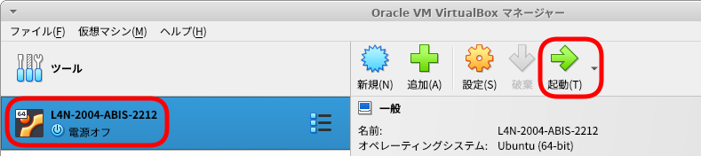

# ABiS脳画像解析チュートリアル用Lin4Neuroのセットアップ

## 目次

- [はじめに](#anchor0)
- [事前準備](#anchor1)
    - [A. 250GB以上あるハードディスク領域の確保](#anchorA)
    - [B. チュートリアル用Lin4Neuro仮想アプライアンスのダウンロード (2-3時間)](#anchorB)
    - [C. VirtualBox 7.0.2以降 のインストール (10分)](#anchorC)
    - [D. Lin4Neuro仮想アプライアンスのインポート (15分)](#anchorD)
    - [E. 仮想マシンの設定 (5分)](#anchorE)
    - [F. Lin4Neuroの起動 (5分)](#anchorF)
    - [参考. 仮想マシンの削除](#anchorG)
- [問い合わせ](#anchor2)

<a id="anchor0"></a>

## はじめに

- **チュートリアルの準備には、約4-5時間必要となります。時間に十分に余裕をもって準備をされてください。なお、準備が終わった方にのみ当日のSlackのリンクが表示されますので、必ず準備を行ってください。準備なしの参加はできません**

- 今回は完全オンライン開催ですが、ここに示すVirtualBox＋Lin4Neuroの組み合わせで参加することで、過去のチュートリアルと同様にチューターや講師による手厚いサポートが受けることができます。脳画像解析の初心者の方々は記載されている通りに事前準備を行いチュートリアルへ参加することを強く推奨します。**ただし、Apple M1/M2環境、および、macOS Catalina では、Lin4Neuroが動作しませんので、別ページにあるmacOS ネイティブ環境のセットアップをご覧になり、準備していただくようお願いします**

- 自分自身で基礎的なトラブルシューティングが行える脳画像解析の経験が豊富な中級者以上の方々は、受講者専用サイトに記載されている以外の解析環境（例えば受講者自身が構築した解析環境など）でもチュートリアルに参加可能ですが、チューターによるサポートは限定されますので、ご理解、ご協力の程、よろしくお願いします

- チュートリアルに十分な環境で参加していただくために、受講環境を整えたうえで、スクリプトを実行してその値が正しい場合に限り当日のSlackのアドレスをお送りします。**2022年12月4日までに**必ず以下の手順を実行してください。テストスクリプトを実行できた方が受講できます。セットアップがうまくいかない方はサポートしますので、早めにご連絡ください。サポート窓口は、このページの一番下にあります。

- 準備ができた方には受講者専用のSlackに招待します。そちらに当日のZoomのリンクなどがありますので、ここの準備が終わった後は、Slackをご確認ください。

<a id="anchor1"></a>

## 事前準備

- Lin4Neuroはチュートリアルにあわせてアップデートされています。**過去のLin4Neuroは使用できませんのでご注意ください**。

- ソフトウェアとデータのダウンロードで合計 40GB程度ダウンロードします。Pocket Wi-Fiなどでは確実にパケ死しますので、職場やご自宅のLAN環境から作業してください

<a id="anchorA"></a>

### A. 250GB以上あるハードディスク領域の確保

- チュートリアルで使うLin4Neuroは最大256GBのハードディスクの設定がなされています。今回から、チュートリアルはすべて仮想マシン内で解析を行いますので、お使いのPCのハードディスク/SSDに250GB以上空きがあるかをご確認ください。もし、ない場合は、外付けHDD/SSDをご準備ください。そして、その中に "vm" などのフォルダを作成してください。後ほど、ここに設定します。なお、外付けハードディスクは若干ですが速度が落ちることをご了承ください。速度の観点からは USB3.0接続のHDD/SSDを推奨します。SDカードは速度が非常に遅いため、使えません。

<a id="anchorB"></a>

### B. チュートリアル用Lin4Neuro仮想アプライアンスのダウンロード (所要時間約3-4時間)

- 分散ダウンロード(推奨): Lin4Neuroの仮想アプライアンスは30GBありますので、分散ダウンロードできるプログラムを準備してあります。自身の環境にあわせて以下の対処を行ってください。Lin4Neuroを30のファイルに分割してダウンロードします。ネットワークの環境にもよりますが、1ファイルあたり5-10分程度かかりますので、ダウンロード終了に約3-4時間かかるとお考えください。なお、2022年12月と2023年1月のチュートリアルで使用するLin4Neuroは同じです。

    - Windows 10/11

        - [Windows用ダウンローダー](https://github.com/kytk/abis-web-202212/releases/download/v20221107/l4n_win.zip)をダウンロードします

        - l4n_win.zip を展開します

        - l4n_win フォルダの中にある `get_L4N_win.bat` をダブルクリックします

        

        - 「WindowsによってPCが保護されました」という画面が出ますので、「詳細情報」をクリックします

        

        - 右下に「実行」ボタンが出ますので、実行をクリックします

        

        - コマンドプロンプトの画面が立ち上がり、ダウンロードが始まります

        

        - ダウンロードが完了すると、l4n_win フォルダの中に L4N-2004-ABIS-20221107.ova というファイルが生成されます
 
    - macOS (Intel mac)

        - [macOS用ダウンローダー](https://github.com/kytk/abis-web-202212/releases/download/v20221107/l4n_mac.zip)をダウンロードします。Safariでダウンロードするとダウンロードフォルダにダウンロードされ、自動で展開されます。もし、自動で展開されない場合、ご自身でl4n_mac.zipを展開されてください。

        - ターミナルを起動します

	- ターミナルに以下をタイプします。

        ```
        cd ~/Downloads
        cd l4n_mac
        bash get_L4N.sh
        ```

        - そうすると、ターミナルが起動し、ダウンロードがはじまります

        

        - ダウンロードが完了すると、L4N-2004-ABIS-20221107 フォルダの中に L4N-2004-ABIS-20221107.ova というファイルが生成されます
 

- 一括ダウンロード: 十分にネットワークが安定している方は、以下からダウンロードしてください。30GBありますのでダウンロードには2〜3時間かかります。ネットワークが細い方は、上の分割ダウンロードを選択してください。分散ダウンロードの方がおそらく速いです

    - [L4N-2004-ABIS-20221107.ovaのダウンロード](http://www.nemotos.net/l4n-abis/L4N-2004-ABIS-20221107.ova){:target="_blank"}

    - L4N-2004-ABIS-20221107.ovaのmd5値は、`deaed5cc9f97432e914c4d63cbdcaf11` になります。ファイルサイズの検証にお使いください

        - macOSならば、`openssl md5 L4N-2004-ABIS-20221107.ova` で確認できます
        - Windowsならば、PowerShellから、`Get-FileHash -Algorithm md5 L4N-2004-ABIS-20221107.ova` で確認できます

<a id="anchorC"></a>

### C. VirtualBox 7.0.2以降 のインストール (所要時間約10分)

チュートリアルでは、**<span style="color: red; ">VirtualBox 7.0.2以降</span>**の上で Lin4Neuro を動作させます。最新版の Lin4Neuro は、VirtualBox 7.0.2 で最適化されているため、前のバージョンのVirtualBoxを使用の方は**必ず7.0.2以降にアップグレードしてください。

- [VirtualBoxのサイト](https://www.virtualbox.org/wiki/Downloads){:target="_blank"} から、ご自身のOSにあったVirtualBoxのインストーラーをダウンロードします

- ダウンロードしたインストーラーを用いてVirtualBox 7.0.2 をインストールします

    - Windowsの方で、"VirtualBox 7.0.2 needs the Microsoft Visual C++ 2019 Redistributable Package" という画面が出る方がいます

        

    - この場合、Microsoft Visual C++ 再頒布可能パッケージをインストールする必要があります。一度、VirtualBoxのインストールを中止し、 https://aka.ms/vs/17/release/vc_redist.x64.exe をダウンロードして、Visual C++ 再頒布可能パッケージをインストールしてから、再度 VirtualBox 7.0.2 をインストールしてください

- インストール後、VirtualBoxを起動します

    
    
<a id="anchorD"></a>

### D. Lin4Neuro仮想アプライアンスのインポート (所要時間約15分) 

- ダウンロードした仮想アプライアンス (L4N-2004-ABIS-20221107.ova) を用いて仮想マシンをインポートします

- VirtualBoxのメニューから **ファイル** → **仮想アプライアンスのインポート** を選択します

- ファイルに、ダウンロードした **L4N-2004-ABIS-20221107.ova** を指定し、 **<kbd>次へ</kbd>** をクリックします 

    

- 設定画面が出ます。ひとつだけ気をつけていただきたいのが、 **Machine Base Folder** です。このフォルダの下に仮想マシンがインストールされます。必ず、**<span style="color: red; ">容量が十分にあるフォルダを指定してください。外付けHDDの方は、先程作った vm フォルダを指定してください。</span>**(容量が十分にある場合は、デフォルトのままでかまいません)

- 設定を確認したうえで、 **インポート** をクリックしてください
- インポートには10−15分程度かかります。辛抱強くお待ちください

    

- インポートが終了すると、VirtualBoxのメイン画面に、 **L4N-2004-ABIS-2212** が表示されます。

    

<a id="anchorE"></a>

### E. 仮想マシンの設定 (所要時間約5分) 

#### 1. メモリの設定

- **CONNはメモリをかなり消費します。そのため、ホストPCにメインメモリが16GB以上ある場合、メモリはデフォルトの4GBでなく、できたら8GBを割り当てることを推奨します。**

- VirtualBoxのメイン画面で、L4N-2004-ABIS-2212をクリックし、選択してから、 **設定** をクリックします

    

- 設定画面の **システム** をクリックします

- メインメモリーがデフォルトでは、4096MB、すなわち4GBとなっています。これを、ご自身のPCのメモリが16GB以上ならば、増やしてください。Windows/macOSが安定して動くためには、システムに最低4GB(できれば8GB)を与えることは必要です。そのうえで、Lin4Neuroのメモリを増やすことで、動きが改善します。お使いのPCが16GBのメモリを搭載しているならば、仮想マシンに8GB (8192MB)と設定してあげてください。1GB=1024MBです

    

#### 2. 共有フォルダの設定

- 2022年12月以降、チュートリアルでは原則共有フォルダは使いません。皆様がLin4Neuroとホストマシンのデータをやりとりしたい時のための設定となります

- 数GB以上あいているところに、Macの方はFinderから、Windowsの方はエクスプローラーから、 **share** というフォルダを作成します。すべて小文字で作成してください

- 設定画面で **共有フォルダー** をクリックしたうえで、画面右側の共有フォルダを追加するアイコンをクリックします

    

- **フォルダーのパス** の右側の▼から、**その他...** を選択し、先程作成した **share** フォルダを選択します

- フォルダー名が **share** になっていることを確認します

- **読み込み専用** と **自動マウント** は**チェックが入っていない**ことを確認してください

- このうえで、 **<kbd>OK</kbd>** をクリックします

    

- これで、設定は終了です

<a id="anchorF"></a>

### F. Lin4Neuroの起動 (所要時間約5分)

- VirtualBoxのメイン画面から、 **L4N-2004-ABIS-2212** を選択したうえで、 **起動** をクリックします

    


- 下図のような画面になります。Enter/return を押すかそのまま待てば自動で起動します

    

- ログイン画面が立ち上がります。パスワードは **lin4neuro** です。すべて小文字です

    

#### ターミナルの設定

- ターミナルに文字列を貼り付ける時に警告が出るのを止めます
- ターミナルを起動します。右下のターミナルのアイコンをクリックしてください

    

- ターミナルのメニューの「編集」をクリックしたうえで「設定」をクリックします

    

- 設定画面の一番下の「安全でない貼り付けのダイアログの表示」のチェックを外したうえで「閉じる」をクリックして閉じてください

    

#### 画面のロックの抑制

- 時間がたつと画面がロックされる設定を解除します
- 画面左下のスタートボタンから「設定」-> 「電源管理」を選択してください

    

- 「ディスプレイ」のタブから、すべての設定を「なし」にすることで、画面がロックされることを抑制できます

    

- これでLin4Neuro内の追加設定は終了です
- https://kytk.github.io/abis-web-202212/ に戻っていただき、「チュートリアルテキストの入手」に進んでください

#### プロキシサーバーを使っている場合(該当する方のみ)

- PCがプロキシサーバを経由して外部ネットワークに接続されている場合は、先にターミナルから以下のコマンドを入力し、システムに対するプロキシ設定およびGitに対するプロキシ設定を行って下さい

    ```
    #システムのプロキシ設定
    cat << 'EOS' > proxy.sh
    MY_PROXY_URL="プロキシ名:ポート番号"
    
    HTTP_PROXY=$MY_PROXY_URL
    HTTPS_PROXY=$MY_PROXY_URL
    FTP_PROXY=$MY_PROXY_URL
    http_proxy=$MY_PROXY_URL
    https_proxy=$MY_PROXY_URL
    ftp_proxy=$MY_PROXY_URL

    export HTTP_PROXY HTTPS_PROXY FTP_PROXY http_proxy https_proxy ftp_proxy
    EOS

    sudo cp proxy.sh /etc/profile.d/proxy.sh
    source /etc/profile.d/proxy.sh
    ```


    ```
    #gitの設定
    git config --global http.proxy  http://プロキシ名:ポート番号
    git config --global https.proxy http://プロキシ名:ポート番号
    ```

- プロキシ名やポート番号は、所属機関･部署のネットワーク管理者にお尋ね下さい

- プロキシ設定が不要になった時は、以下のコマンドによって解除できます：

    ```
    git config --global --unset http.proxy
    git config --global --unset https.proxy
    ```

<a id="anchorG"></a>

### 参考. 仮想マシンの削除 (チュートリアル後、不要になった場合)

1. 仮想マシンを削除するには、VirtualBoxのメイン画面で、削除したい仮想マシンを選び、右クリックをして、**除去(R)...** を選択します

    

2. 次にあらわれる画面で、**すべてのファイルを削除** を選択します

    

<a id="anchor2"></a>

## 問い合わせ

- 準備がうまくいかない時のために、問い合わせフォームを準備しています。こちらからご質問ください。数日以内に担当者から返信させていただきます

- [問い合わせフォーム](https://forms.gle/NNCjrKn4uQJeYKdg6){:target="_blank"} 


