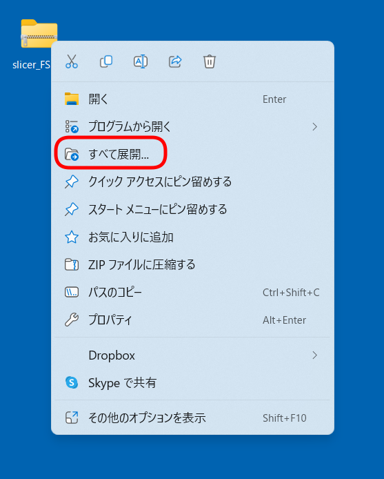
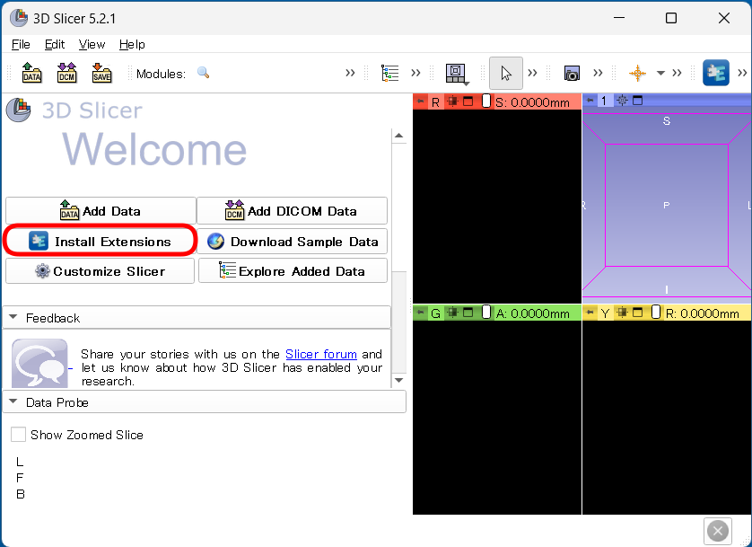

# Windows, macOS native 環境への 3D Slicer の設定方法
 
## 目次

- [はじめに](#anchor0)
- [データのダウンロード](#anchor1)
- [3D Slicerのインストール](#anchor2)
- [SlicerFreeSurferのインストール](#anchor3)
- [3D Slicerの確認](#anchor4)
- [問い合わせ](#anchor5)

## はじめに

- 本セクションでは、Windows/macOS への 3D Slicer のセットアップ方法を記載します。Lin4Neuroに搭載している 3D Slicer は FreeSurfer の一部のデータが読み込めないバグがあることがわかりました。このため、皆様の各自の環境に 3D Slicer をインストールしていただきます。すでにmacOS native で設定されている方は データのダウンロード と 3D Slicerの確認 だけやってもらえれば大丈夫です

## データのダウンロード

- [こちらのリンク](http://www.nemotos.net/abis-data/abis-202212/slicer_FS.zip)を右クリックし、「名前をつけて保存」から、slicer_FS.zip をダウンロードしてください。皆の環境を統一するために、デスクトップに保存してください。iCloud Drive や OneDrive を有効にされている方は、一時的に、デスクトップが同期されないようにしていただいてもいいかもしれません。なお、そのリンクがだめな場合は、[別のリンク](https://www.dropbox.com/t/l6OzdnNE2xkUIpjM)からダウンロードしてください。

- macOS の方はそのまま展開していただければ、slicer_FS のディレクトリができますので、それで準備完了です。

- Windows の方はそのまま展開すると slicer_FS の中に slicer_FS フォルダができてしまいます。それを避けるために、slicer_FS.zip を右クリックし、「全て展開」を選んだ後、展開先を"C:\Users\ユーザー名\Desktop\" としてください

    
    

## 3D Slicer のインストール

- https://download.slicer.org/ にアクセスしてください

- ご自身のOSにあったバージョンをインストールしてください

- 既に 5.0.3 をインストールしてくださった方はアップデートしなくても大丈夫です

    

## SlicerFreeSurferのインストール

- Slicer を起動してください

- "Install Extensions" をクリックしてください

    

- 検索ボックスに "FreeSurfer" と入力し、出てくる "SlicerFreeSurfer" をクリックしてください

    

- 画面左側の "INSTALL" をクリックすることで、SlicerFreeSurferがダウンロードできます

    

- インストールが終了すると、"Restart required" と画面左下に表示されますので、"Restart" でSlicerを再起動してください

## Slicer の確認

- デスクトップにダウンロードしたデータを読み込めるか確認します

- Slicerの画面の"Welcome to Slicer" をクリックし、"Utilities" -> "FreeSurfer Importer" をクリックします

    

- 画面左側から以下を設定します

    - FreeSurfer directory: 右端の ... をクリックして、デスクトップにある slicer_FS -> subjects -> bert を選択してください。そうすると、以下のVolumesなどが選択できるようになります

    - Volumes: brainmask.mgz を選択してください
    
    - Segmentations: aseg.mgz を選択してください

    - Models: lh.pial を選択してください
    
    - Reference volume: brainmask.mgz を選択してください

    - 全部選べたら "Load" をクリックしてください

    

- うまくいけば、以下のような図が表示されるはずです

    
 

## 問い合わせ

- 準備がうまくいかない場合は、Slackの「事前準備」チャンネルでご質問ください

